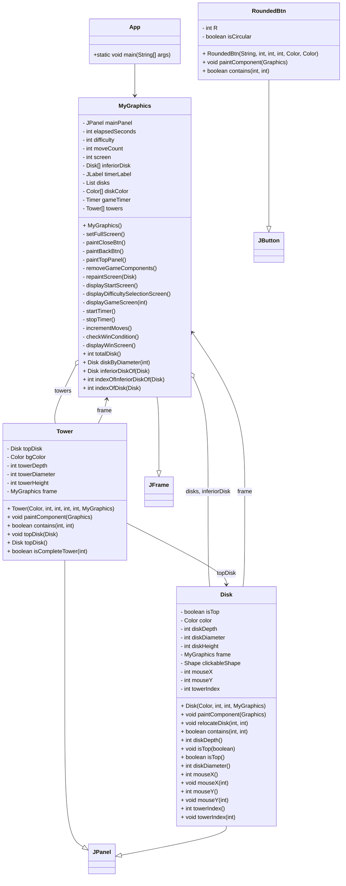

## Welcome

This is a desktop app of the Hanoi Towers Game

## Build Instructions

To get started with building the application, follow these steps:

1. Install the necessary dependencies.
2. Build the project using your preferred build tool.
3. Run the application to start playing.

## How to Play Towers of Hanoi

The Towers of Hanoi is a puzzle game that consists of three rods and a number of disks of different sizes which can slide onto any rod. The puzzle starts with the disks neatly stacked in ascending order of size on one rod, the smallest one at the top, making a conical shape.

### Objective

-   The objective is to move the entire stack to another rod, obeying the following rules:
    1. Only one disk can be moved at a time.
    2. Each move involves taking the top disk from one of the stacks and placing it on top of another stack or an empty rod.
    3. No larger disk may be placed on top of a smaller disk.

### Tips

-   Begin with moving smaller disks and gradually make space for larger disks.
-   Try to maintain the larger disks at the base during moves.

### Strategy

A simple algorithm to solve the Towers of Hanoi puzzle is as follows:

1. Move \( n-1 \) disks from the source rod to an auxiliary rod.
2. Move the nth disk from the source rod to the destination rod.
3. Move the \( n-1 \) disks from the auxiliary rod to the destination rod.

Enjoy playing and challenge yourself to solve it in the fewest number of moves possible!

##Class Diagram

